# 05 · Database Schema & ERD

MySQL 8, InnoDB, `utf8mb4`. Conventions: snake_case tables (plural), `id` BIGINT PK, `created_at/updated_at`, `deleted_at` (soft deletes on core entities), UUID `public_id` on externally-referenced rows (leads, clinics, invoices) to avoid enumeration. Money stored as integer minor units + `currency` (ISO-4217) — never floats. All user-generated content is translatable (see i18n note).

## 1. ERD (Mermaid)

```mermaid
erDiagram
    USERS ||--o{ CLINIC_USER : membership
    CLINICS ||--o{ CLINIC_USER : has
    CLINICS ||--o{ DOCTORS : employs
    CLINICS ||--o{ CLINIC_TREATMENT : offers
    TREATMENTS ||--o{ CLINIC_TREATMENT : offered_by
    TREATMENTS ||--o{ TREATMENT_CATEGORY_MAP : in
    TREATMENT_CATEGORIES ||--o{ TREATMENT_CATEGORY_MAP : groups
    DOCTORS ||--o{ DOCTOR_TREATMENT : performs
    TREATMENTS ||--o{ DOCTOR_TREATMENT : performed_by
    CLINICS ||--o{ CLINIC_MEDIA : has
    DOCTORS ||--o{ DOCTOR_MEDIA : has
    CLINICS ||--o{ CERTIFICATES : holds
    CLINICS ||--o{ BEFORE_AFTER_CASES : shows
    DOCTORS ||--o{ BEFORE_AFTER_CASES : performed
    TREATMENTS ||--o{ BEFORE_AFTER_CASES : of
    LEADS ||--o{ LEAD_ASSIGNMENTS : routed_to
    CLINICS ||--o{ LEAD_ASSIGNMENTS : receives
    LEADS ||--o{ OFFERS : receives
    CLINICS ||--o{ OFFERS : sends
    LEADS ||--o{ MESSAGES : thread
    LEADS ||--o{ LEAD_ACTIVITIES : log
    LEADS }o--|| TREATMENTS : primary_treatment
    LEADS }o--|| COUNTRIES : from
    LEADS ||--o{ APPOINTMENTS : schedules
    CLINICS ||--o{ APPOINTMENTS : hosts
    LEADS ||--o| TREATMENT_CASES : becomes
    TREATMENT_CASES ||--o{ COMMISSIONS : generates
    TREATMENT_CASES ||--o{ INVOICES : billed
    CLINICS ||--o{ SUBSCRIPTIONS : subscribes
    SUBSCRIPTION_PLANS ||--o{ SUBSCRIPTIONS : plan
    SUBSCRIPTIONS ||--o{ INVOICES : billed
    CLINICS ||--o{ REVIEWS : reviewed
    DOCTORS ||--o{ REVIEWS : reviewed
    TREATMENT_CASES ||--o| REVIEWS : verified_by
    USERS ||--o{ REVIEWS : writes
    COUNTRIES ||--o{ COUNTRY_TREATMENT : pSEO
    TREATMENTS ||--o{ COUNTRY_TREATMENT : pSEO
    POSTS }o--|| POST_CATEGORIES : in
    USERS ||--o{ POSTS : authors
    CITIES ||--o{ CLINICS : located_in
    LEADS ||--o{ CONSENTS : records
    USERS ||--o{ CONSENTS : gives
```



## 2. Core tables

### Identity & access
```
users             id, public_id, name, email(unique), password, phone, whatsapp,
                  country_id, locale, role_cache, avatar_path, email_verified_at,
                  two_factor_secret, last_login_at, status, timestamps, soft-deletes
roles             (spatie) id, name, guard
permissions       (spatie) id, name, guard
model_has_roles / role_has_permissions / model_has_permissions  (spatie pivots)
clinic_user       clinic_id, user_id, role(owner|manager|staff), invited_at, timestamps
                  # a user can belong to multiple clinics; permissions scoped per clinic
```

### Geography & taxonomy
```
countries         id, iso2, iso3, name, slug, currency, dial_code, flag_path,
                  is_target, tier(primary|secondary|future), timestamps
cities            id, country_id, name, slug, lat, lng, airport_code, timestamps
languages         id, code(BCP47), name, native_name, direction(ltr|rtl), is_active, sort
treatment_categories  id, parent_id(null), name, slug, icon, sort, timestamps
treatments        id, slug, name, category_id, icon, avg_duration_min, recovery_days,
                  trips_required, base_price_min, base_price_max, currency,
                  is_featured, sort, status(draft|published), seo_id, timestamps, soft-deletes
treatment_category_map  treatment_id, treatment_category_id   # many-to-many
country_treatment (pSEO)  id, country_id, treatment_id, local_price_min, local_price_max,
                  turkey_price_min, turkey_price_max, savings_pct, flight_info_json,
                  content_id, seo_id, status, timestamps
```

### Clinics
```
clinics           id, public_id, slug, name, legal_name, city_id, address, lat, lng,
                  phone, whatsapp, email, website, about, founded_year, patients_treated,
                  verification_tier(pending|verified|verified_plus|elite),
                  verified_at, verified_by(user_id), response_time_minutes,
                  languages_json, rating_avg, rating_count, is_active, is_featured,
                  seo_id, owner_user_id, timestamps, soft-deletes
clinic_media      id, clinic_id, type(image|video|logo|tour360), path, alt, caption,
                  is_cover, sort, timestamps
certificates      id, certifiable_type/id (clinic|doctor), name, issuer, doc_path,
                  issued_at, expires_at, verified(bool), timestamps
technologies      id, name, slug, icon                    # e.g. CBCT, CEREC, 3D scanner
clinic_technology clinic_id, technology_id
clinic_treatment  id, clinic_id, treatment_id, price_min, price_max, currency,
                  notes, is_available, timestamps      # price per clinic per treatment
```

### Doctors
```
doctors           id, public_id, slug, clinic_id, user_id(null), full_name, title,
                  specialty, bio, years_experience, languages_json, photo_path,
                  rating_avg, rating_count, is_featured, seo_id, timestamps, soft-deletes
doctor_media      id, doctor_id, type, path, alt, sort
doctor_education  id, doctor_id, institution, degree, field, start_year, end_year
doctor_experience id, doctor_id, organization, role, start_year, end_year, description
doctor_awards     id, doctor_id, title, issuer, year
doctor_treatment  doctor_id, treatment_id
```

### Before/After & reviews
```
before_after_cases id, public_id, clinic_id, doctor_id(null), treatment_id, title,
                  description, before_media_id, after_media_id, patient_country_id,
                  consent_doc_path, is_published, timestamps
reviews           id, public_id, reviewable_type/id(clinic|doctor), user_id,
                  treatment_case_id(null → verified), rating(1-5), title, body,
                  treatment_id, status(pending|approved|rejected), ai_summary_cache,
                  moderated_by, moderated_at, timestamps, soft-deletes
review_criteria   id, review_id, criterion(communication|cleanliness|value|result), score
```

### Leads / CRM
```
leads             id, public_id, user_id(null), full_name, email, phone, whatsapp,
                  country_id, primary_treatment_id, treatments_json, budget_min, budget_max,
                  currency, timeline(asap|1-3m|3-6m|flexible), message, source(utm_json),
                  channel(web|ai_advisor|whatsapp|referral), status(new|qualifying|
                  qualified|assigned|offer_sent|negotiating|won|lost|invalid),
                  score(int), assigned_agent_id, quality(cold|warm|hot), locale,
                  first_response_at, closed_at, lost_reason, timestamps, soft-deletes
lead_media        id, lead_id, type(photo|xray|doc), path, uploaded_at
lead_assignments  id, lead_id, clinic_id, assigned_by, status(offered|accepted|declined|
                  expired), assigned_at, responded_at, sla_due_at
offers            id, public_id, lead_id, clinic_id, doctor_id(null), title, treatment_plan,
                  price_total, currency, breakdown_json, valid_until, includes_json
                  (hotel/transfer/warranty), status(sent|viewed|accepted|rejected|expired),
                  timestamps
messages          id, thread_type(lead|offer|support), thread_id, sender_type(user|clinic|
                  agent|system), sender_id, body, attachments_json, channel(web|whatsapp|
                  email), read_at, timestamps
lead_activities   id, lead_id, actor_type/id, type(status_change|note|call|email|whatsapp|
                  assignment|system), payload_json, created_at
appointments      id, public_id, lead_id, clinic_id, doctor_id(null), type(remote_consult|
                  onsite), scheduled_at, timezone, status(requested|confirmed|completed|
                  cancelled|no_show), meeting_url, notes, timestamps
```

### Treatment lifecycle, commissions, billing
```
treatment_cases   id, public_id, lead_id, clinic_id, doctor_id(null), treatment_ids_json,
                  agreed_price, currency, status(planned|in_treatment|completed|refunded),
                  arrival_date, completion_date, notes, timestamps
commissions       id, treatment_case_id, clinic_id, base_amount, rate_pct, amount,
                  currency, status(pending|invoiced|paid|waived|disputed), due_at,
                  paid_at, invoice_id, timestamps
subscription_plans id, name, slug, tier, price_month, price_year, currency, features_json,
                  lead_quota, is_active, sort
subscriptions     id, clinic_id, plan_id, status(trialing|active|past_due|canceled),
                  started_at, renews_at, canceled_at, provider(stripe|iyzico),
                  provider_ref, timestamps
invoices          id, public_id, number, billable_type/id(subscription|commission|clinic),
                  clinic_id, amount, tax, total, currency, status(draft|sent|paid|overdue|
                  void), issued_at, due_at, paid_at, pdf_path, provider_ref, timestamps
payments          id, invoice_id, provider, provider_ref, amount, currency,
                  status(succeeded|failed|refunded), method, paid_at, raw_json, timestamps
```

### Content, SEO, media
```
posts             id, slug, category_id, author_id, reviewer_id(null medically-reviewed-by),
                  title, excerpt, body(rich), cover_media_id, reading_minutes,
                  status(draft|scheduled|published), published_at, seo_id, timestamps, soft-deletes
post_categories   id, parent_id, name, slug, description, seo_id, sort
faqs              id, faqable_type/id(treatment|clinic|country|page|global), question,
                  answer, sort, status, timestamps
seo_meta          id, seoable_type/id, title, meta_description, canonical_url,
                  og_title, og_description, og_image_path, robots(index/follow flags),
                  schema_json_override, focus_keyword, timestamps
redirects         id, from_path, to_path, code(301|302), hits, timestamps
media             id, uuid, disk, path, mime, size, width, height, variants_json
                  (avif/webp/sizes), alt, checksum, uploaded_by, timestamps   # central library
mediables         media_id, mediable_type/id, role, sort   # polymorphic attach
translations      id, translatable_type/id, locale, field, value   # generic i18n store
                  # (or spatie/laravel-translatable JSON columns per model — see i18n note)
```

### Consent, audit, notifications, settings
```
consents          id, consentable_type/id(lead|user), type(marketing|data_processing|
                  medical_share|cookies), granted(bool), text_version, ip, user_agent,
                  granted_at, revoked_at        # GDPR audit trail
audit_logs        id, user_id, event, auditable_type/id, old_json, new_json, ip, ua, created_at
notifications     (laravel) id(uuid), type, notifiable_type/id, data_json, read_at, timestamps
settings          id, group, key, value_json, is_public       # site config
email_templates   id, key, locale, subject, body_html, variables_json
webhooks_incoming id, provider, event, payload_json, processed_at, status  # stripe/whatsapp
jobs / failed_jobs / job_batches                              # queue infra
```

## 3. Key indexes & constraints
- `leads`: index `(status, created_at)`, `(assigned_agent_id, status)`, `(country_id, primary_treatment_id)`; FULLTEXT on message optional (search via Meilisearch instead).
- `clinics`: index `(city_id, is_active, verification_tier)`, `(is_featured)`; `slug` unique.
- `clinic_treatment`: unique `(clinic_id, treatment_id)`.
- `reviews`: index `(reviewable_type, reviewable_id, status)`; only rows with `treatment_case_id` render the "Verified" badge.
- `commissions`: index `(clinic_id, status)`, `(due_at)`.
- `country_treatment`: unique `(country_id, treatment_id)`.
- FKs with `ON DELETE RESTRICT` for financial rows, `CASCADE` only for pure children (media, activities).

## 4. Search (Meilisearch) indexes
`clinics`, `doctors`, `treatments`, `posts`, `cities` — synced via Laravel Scout. Facets: treatment, city, verification_tier, language, price_band, rating. Typo-tolerance + synonyms (e.g. "implant"↔"implants", "hollywood smile"↔"veneers set").

## 5. i18n storage strategy
Two-layer: (a) **static UI strings** in Laravel lang files per locale; (b) **content translations** for treatments/posts/clinics/SEO via `spatie/laravel-translatable` JSON columns (`name`, `body`, `meta` stored as `{"en":..,"tr":..}`) OR the generic `translations` table for high-cardinality/late-added languages. Every translatable model exposes a `getTranslation(field, locale, fallback=true)`. hreflang generated from available locales per entity. See [06](06-seo-architecture.md) and [08](08-laravel-architecture.md).

## 6. Data retention & privacy
Lead PII retention policy (e.g. purge/anonymize inactive raw leads after defined period unless converted), medical images encrypted at rest (S3 SSE + app-level for x-rays), consent + audit immutable, GDPR erasure job anonymizes `leads`/`users` while preserving aggregate financials (invoices keep legal minimum, PII stripped).
